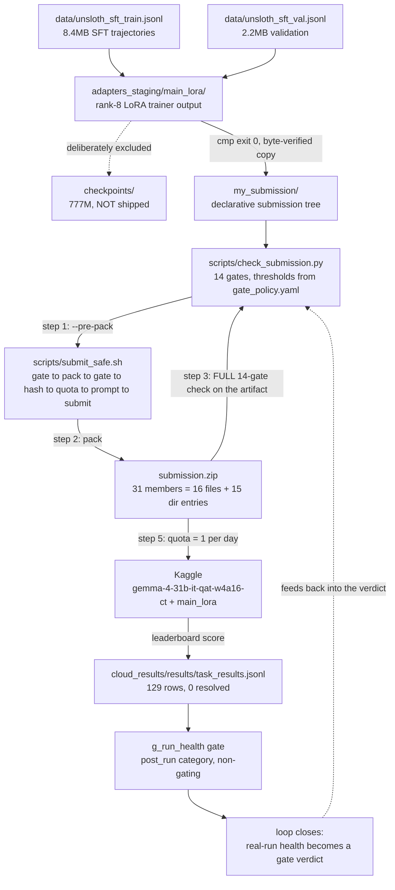

# DATA_FLOW.md — where every artifact lives, how it moves, and what is provably correct

Read this file **instead of grepping**. It is a map and a set of load-bearing facts: which
paths exist, in which storage tier, which ones ship, and which claims have been measured
rather than assumed. It deliberately contains **no design rationale** — the reasoning lives in
[`SHARED_UNDERSTANDING.md`](SHARED_UNDERSTANDING.md) and the harness spec in
[`HARNESS_README.md`](../HARNESS_README.md). If you need "why", go there. If you need "where"
or "is it true", stay here.

All sizes and counts below were **measured**, not estimated. Where a number is rounded, the
source line is cited in [§8](#8-where-to-look-for-what).

---

## 1. Storage tiers

The working directory is **≈42GB, but only ≈327MB of that is tracked** — `.git` is ≈1.1GB.
The 42GB is on disk, *not* in git. This is why `du -sh .` is a misleading signal here.

| Tier | Contents | Measured size |
|---|---|---|
| **On-disk, `.gitignore`d, 0 tracked files** | `snapshots/` | ~20G |
| | `models/` | ~18G |
| | `adapters_staging/` | ~848M |
| | `checkpoints/` | ~777M |
| | `embeddings/` | ~446M |
| | `graphs/` | ~403M |
| | `results/` | ~124M |
| | `wheels/` | ~27M |
| **Tracked source** | `.git` | ~1.1G |
| | all tracked files combined | ~327M |
| **Build artifact** (rebuildable in seconds) | `submission.zip` | 81MB |
| **Shipped** (inside the zip) | see [§4](#4-submission-manifest) | unpacked 86.4MB |
| **Remote** | Kaggle leaderboard | 2 submissions on record |

**Largest tracked files** (all under GitHub's 100MB per-file hard limit):

| File | Size |
|---|---|
| `my_submission/adapters/main_lora/adapter_model.safetensors` | 86MB |
| `submission.zip` | 81MB |
| `kaggle_adapter_dataset/adapter_model.safetensors` | 69MB |
| `cloud_results/canary_test_results/submission/adapters/main_lora/adapter_model.safetensors` | 69MB |
| `data/unsloth_sft_train.jsonl` | 8.4MB |
| `data/unsloth_sft_val.jsonl` | 2.2MB |
| `tasks.jsonl` | 1.9MB |

**Git-history hazard:** history holds **~336MB** of `submission.zip` blobs (four 64.1MB + one
79.5MB). Every repack that is committed adds ~80MB *permanently* to immutable history. The
cheap direction is `git rm --cached submission.zip`; purging existing blobs needs a rewrite that
invalidates every commit SHA and tag. See the git-hygiene rules in
[`AGENTS.md`](../AGENTS.md).

---

## 2. Architecture / data flow

The loop has exactly one closed circle: **a real run's results feed back into the gates**, so
the gates can be wrong *about a run that already happened* (`g_run_health`). The final arrow is
the loop that closes.

### Mermaid



### ASCII fallback (same flow, same nodes)

```
  data/unsloth_sft_train.jsonl (8.4MB) ─┐
                                         ├─> adapters_staging/main_lora/ (rank-8 LoRA)
  data/unsloth_sft_val.jsonl    (2.2MB) ─┘        │
                                              (cmp exit 0)   └──X──> checkpoints/ (777M, NOT shipped)
  ──> my_submission/ (declarative tree)
        ──> scripts/check_submission.py (14 gates, thresholds from scripts/gate_policy.yaml)
              │ step 1: --pre-pack
              v
           scripts/submit_safe.sh
             (gate -> pack -> gate-the-artifact -> hash -> quota -> prompt -> submit)
              │ step 2: pack
              v
           submission.zip (31 members = 16 files + 15 dir entries)
              │ step 3: FULL 14-gate check on the artifact ──> back into check_submission.py
              │ step 5: quota = 1/day
              v
           Kaggle (gemma-4-31b-it-qat-w4a16-ct + adapter main_lora)
              │ leaderboard score
              v
           cloud_results/results/task_results.jsonl (129 rows, 0 resolved)
              v
           g_run_health (post_run category, NON-GATING)
              v
   ╔════════════════════════════════════════════════════════════╗
   ║  LOOP CLOSES: real-run health becomes a gate verdict,      ║
   ║  which feeds back into check_submission.py                  ║
   ╚════════════════════════════════════════════════════════════╝
```

---

## 3. The result loop (the point of the whole system)

| Fact | Value |
|---|---|
| Only real Gemma 4 run | `cloud_results/results/task_results.jsonl` |
| Rows / resolved | 129 rows, **0 resolved** |
| Exit-code histogram | `{-1: 115, 1: 6, 2: 5, 124: 3}` |
| Gate verdict on that run | `INFRASTRUCTURE FAILURE, NOT A QUALITY RESULT` |
| Kaggle refs | `56744693` (2026-10-01, no score), `56765397` (2026-10-02, publicScore **0.03**) |

`g_run_health` **is still failing, deliberately.** That run genuinely was an infrastructure
failure, so the gate is telling the truth. Suppressing it would be the actual bug.

**Known false alarm:** `configs/sampling.yaml` sets `max_output_tokens: 16384`, which is the
**harness default** (`HARNESS_README.md:147`, range 1–32768) and is explicitly recommended at
`HARNESS_README.md:663` ("a reasonable thinking_budget (e.g. 4096 with max_output_tokens:
16384)"). The "project cap 4096" in `scripts/gate_policy.yaml` is **STALE** and produces a
known WARN. Trust the harness, not the stale cap.

---

## 4. Submission manifest

`submission.zip` has **31 members = 16 real files + 15 directory entries**, **flat root, no
nested wrapper prefix** (the first-level dirs `skills/`, `configs/`, `prompts/`, `adapters/` are
intentional, not a packaging prefix).

**The 16 shipped files, exactly:**

```
agent.yaml
eval_config.yaml
configs/sampling.yaml
prompts/main.md
adapters/main_lora/adapter_config.json
adapters/main_lora/adapter_model.safetensors
skills/code-map/SKILL.md
skills/code-map/scripts/map.py
skills/fast-grep/SKILL.md
skills/fast-grep/scripts/grep.py
skills/code-oracle/SKILL.md
skills/code-oracle/scripts/oracle.py
skills/repro-check/SKILL.md
skills/repro-check/scripts/check.py
skills/test-gate/SKILL.md
skills/test-gate/scripts/gate.py
```

That is 6 non-skill files + 5 skills × 2 files (a `SKILL.md` plus one script) = 16. Note the
script filenames are **short verbs**, not the skill name: `map.py`, `grep.py`, `oracle.py`,
`check.py`, `gate.py`.

**What is NOT in here:** no `tests/`, no `tasks.jsonl`, no gold patches, no `.npz` embeddings,
no graphs, no snapshots, no wheels, no `checkpoints/`, no `.jsonl` dataset, no `__pycache__`,
no `.DS_Store`.

**Adapter provenance — it is genuinely trained, not a random-init stub:**

| Property | Value |
|---|---|
| Tensors / modules | 460 tensors across 230 modules |
| Rank | 8 |
| `lora_alpha` | 16 (effective scale 2.0) |
| Dtype | F32 |
| Targets | `q_proj`, `k_proj`, `v_proj`, `o_proj` |
| Training | 60 steps, loss 6.8636 → 3.5135, LR annealed to 1.63e-08 |
| Copy integrity | byte-verified from `adapters_staging/main_lora/` with `cmp` exit 0 |

**Why "all 230 `lora_B` tensors are nonzero" is a proof, not an observation:** PEFT
**zero-initializes `lora_B`**. A freshly-created adapter has all-zero `lora_B`. Therefore
nonzero `lora_B` is only reachable by gradient descent actually running. This is the single
strongest piece of evidence that the adapter was trained.

**Config facts that ship:** `agent.yaml` declares `model: gemma-4-31b-it-qat-w4a16-ct` and
`adapter: main_lora`. `configs/sampling.yaml` is `temperature: 0.15`, `top_p: 0.95`,
`max_output_tokens: 16384`, `thinking_config.thinking_budget: 4096`,
`thinking_config.include_thoughts: true`. `thinking_level` is **deliberately ABSENT** —
LiteLLM mistranslates it into OpenAI `reasoning_effort`.

**Budget parity is exact:** the prompt's tool budget is **40**, matching
`eval_config.yaml:4` `max_tool_calls: 40`. 40 = 40, and the prompt ladder is monotone.

---

## 5. Integrity verification

This section is the answer to "**is it taking from the test folder?**". No. Measured three ways.

**Leakage — zero.** No zip member matches `tests/`, `test_`, `tasks.jsonl`, `gold`,
`expected`, `solution`, `answer`, `dataset`, `data/`, `.jsonl`, `graph`, `embedding`,
`.npz`, or `snapshot`.

**Gold patches — zero.** No `FAIL_TO_PASS`, `PASS_TO_PASS`, `gold_patch`, `expected_patch`, or
`solution_diff` appears anywhere in `my_submission/`.

**`tests/` is never packaged and never read at inference time.** It exists only to run the
local gate suite (`tests/test_check_submission.py`, **33 passed**). The gates read
`my_submission/`, `scripts/`, `docs/`, `adapters_staging/`, and `cloud_results/` — **never
`tests/`**.

**The skills DO mention repo paths, and every mention is safe.** This is the part that looks
alarming and is not, so here is the full accounting:

| Shipped skill mentions | Why it is safe |
|---|---|
| `wheels` / `snapshots` / `embeddings` / `.npz` | Appear **only inside `SKIP_DIRS` / ignore-lists**. They are *skipped*, never read. |
| `graphs/` | Strictly **optional**, with `fallback_mode: "live_ast"` plus an explicit diagnostic. Absent on Kaggle, and the skill still works. |
| `tasks.jsonl` | Used **only as a repo-detection signal** via `(parent / "tasks.jsonl").exists()` sitting next to `pyproject.toml` / `setup.py` / `.git`. It is **never opened**. |

**Conclusion: the skills are self-sufficient on Kaggle and depend on no unshipped asset.**

---

## 6. Gate system

`scripts/check_submission.py` implements **14 gates** in **3 categories**:

| Category | Count | Governs exit code? |
|---|---|---|
| `submission` | 12 | **YES — these 12 alone** |
| `post_run` | 1 (`g_run_health`) | no |
| `hygiene` | 1 (`g_no_embedded_code_in_docs`) | no |

WARN never affects the exit code, in any category. A non-`submission` gate can only veto if an
operator explicitly selects its category.

**Every threshold lives in `scripts/gate_policy.yaml`** — that file is the single source of
truth, and the code *reads* it rather than hardcoding. An AST test enforces that the code really
does depend on the policy file.

**Current status: exit 0** — 11 passed / 1 failed / 2 warnings, **0 gating FAILs**. The one
FAIL is non-gating `g_run_health`. Local suite: **33 passed**.

**`scripts/submit_safe.sh` is the only supported submission path:**

```
gate -> pack -> gate-the-artifact -> hash -> quota -> prompt -> submit
```

- **Step 1** validates the *source tree* using `--pre-pack`, which skips the 4 zip-dependent
  gates and prints one explicit `SKIPPED (pre-pack): <gate>` line per skip — never a silent
  skip.
- **Step 3** runs the **FULL 14-gate check on the packed artifact**.

**Submission quota is 1 per day.** Authoritative source: `scripts/gate_policy.yaml`
`submission_quota.per_day`. One shot a day; there is no retry budget to spend casually.

---

## 7. Three tiers of correctness

This is the honest answer to "how do I know it's correct?" — because the answer differs by tier,
and blurring them is how a 0.03 gets mistaken for a win.

**Tier 1 — Proven by direct inspection.**
No leakage. No gold patches. Skills are self-sufficient. Budget parity 40 = 40. The adapter is
genuinely trained (230 nonzero `lora_B`) and byte-identical to its staging source. The zip is
byte-identical to the source tree.

**Tier 2 — Structurally correct (gates green, exit 0).**
Config coherence, archive layout, file extensions, unpacked size 86.4MB against the 3072MB cap.
This is necessary and it is **not** sufficient.

**Tier 3 — UNPROVEN. Only a real Kaggle run can settle it.**
Whether the agent scores above 0.03. Whether the adapter helps or hurts. Whether the serving
path works end to end. **Do not blur these tiers.** Nothing in this repository can answer a
tier-3 question, because the only real run on record resolved 0 of 129.

---

## 8. Where to look for what

The anti-grep table. Every answer has an authoritative `file:line`.

| Question | Authoritative source |
|---|---|
| How do I check the tool budget? | `my_submission/eval_config.yaml:4` (`max_tool_calls: 40`) and `my_submission/prompts/main.md:59` |
| How do I check the adapter is real? | `my_submission/adapters/main_lora/adapter_config.json` (rank 8, `lora_alpha` 16, `q/k/v/o_proj`); nonzero `lora_B` across all 230 modules |
| How do I check what ships? | `scripts/check_submission.py:1183` (`g_zip_root_layout`) and `:1120` (`g_zip_directory_drift`); the exclusion vocabulary is `scripts/gate_policy.yaml` `packaging.excluded_globs` (line 98) |
| How do I check the exit code? | `scripts/check_submission.py:13-16` — exit 0 unless a `submission`-category gate FAILs |
| Where do thresholds live? | `scripts/gate_policy.yaml` (single source of truth; read by the code, enforced by an AST test) |
| Where are the last real run's results? | `cloud_results/results/task_results.jsonl` (129 rows, 0 resolved) |
| What is the quota? | `scripts/gate_policy.yaml:78` (`submission_quota.per_day: 1`) |
| Which keys do the gates forbid? | `scripts/gate_policy.yaml:48` (`forbidden_sampling_keys: thinking_level`) |
| What is the max unpacked size? | `scripts/gate_policy.yaml:62` (`max_unpacked_mb: 3072`) |
| What are the two-phase validation semantics? | `scripts/check_submission.py:18-45` |
| What is the model allowlist / adapter base? | `scripts/gate_policy.yaml:8-9` and `:36` |
| Where is the run-health threshold? | `scripts/gate_policy.yaml:66-73` (`run_health`) |

---

## 9. Cross-links

| Document | What it is for |
|---|---|
| [`SHARED_UNDERSTANDING.md`](SHARED_UNDERSTANDING.md) | **Design of record.** Why the architecture is what it is. |
| [`HARNESS_README.md`](../HARNESS_README.md) | **Authoritative harness spec** (671 lines). Wins over any local note. |
| [`scripts/gate_policy.yaml`](../scripts/gate_policy.yaml) | Single source of truth for every gate threshold. |
| [`.agents/skills/kaggle-submit/SKILL.md`](../.agents/skills/kaggle-submit/SKILL.md) | **Operator runbook** for the submission path. |
| [`AGENTS.md`](../AGENTS.md) | **Git-hygiene rules** — what must stay out of history, and why. |
| [`START_HERE.md`](START_HERE.md) | Entry point / orientation. |
