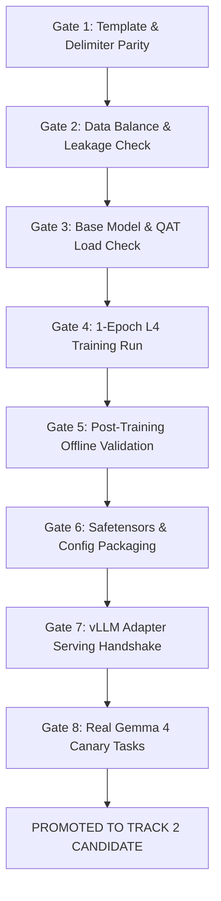

# 08. Consultant Consensus & Unified Track 2 Action Plan

> **Document Status:** Post-Review Consensus & Implementation Blueprint  
> **Date:** October 7, 2026  
> **Audience:** Core Engineering Team, External Reviewers, Evaluation Orchestrator  
> **Source Inputs:** Internal Research Findings (`07`), Consultant 1, Consultant 2, and Consultant 3 Technical Reviews  

---

## Executive Summary & Verdict

All three external consultants and our internal research pool reached **100% unanimous agreement** on the core diagnosis:

1. **Track 2 LoRA is structurally sound in principle**, but the repository's previous training pipeline and data were **dead on arrival** due to four simultaneous structural defects:
   - **Protocol Mismatch:** Hardcoded Gemma 2/3 `<start_of_turn>` tags and invalid symmetric `<|tool_call|>` delimiters in `build_unsloth_dataset.py` and `train_gemma4_lora_minimal.ipynb`.
   - **Model Fallback:** Risk of silent remapping to BitsAndBytes NF4 (`unsloth/gemma-4-31B-it-unsloth-bnb-4bit`).
   - **Severe Data Skew:** 0% `run_command`, 64.3% `run_skill_script`, 32.7% tool-less stall turns (`target_tools: []`), and 100% train/val task leakage.
   - **Training/Serving Traps:** The 262K-vocab Step-5 evaluation OOM (`7.50 GiB` logits), the `max_steps = 25` truncation bug, and packaging invalid `.model` tokenizer files.
2. **The 885-sample volume is sufficient for a Rank-8 behavioral adapter**, but only after fixing the template, merging thought-action turns, synthesizing verified `run_command` verification loops across Tier-1 tasks, and splitting cleanly by `task_id`.
3. **Execution Sequencing:** Data pipeline reconstruction and template alignment must precede any GPU training. Once trained, the adapter must pass an 8-stage verification gate before mounting in Kaggle.

---

## 1. Cross-Review Comparison: Consensus vs. Nuances

| Dimension | Internal Audit (`07`) | Consultant 1 | Consultant 2 | Consultant 3 | **Unified Decision** |
|---|---|---|---|---|---|
| **Chat Template** | Native `<|turn>`, `<|thought>`, `<|tool_call>`, `<tool_call|>` | Rewrite template, mask `<|turn>model\n` | Native asymmetric tokens, merge thought+tool | Exact prefix-delta masking with precomputed labels, `<|tool_response>` stop cue | **Consultant 3 Prefix-Delta Masking** with `<|channel>thought\n...<channel|>` (Gemma 4 has no `<|thought>` token) |
| **Base Checkpoint** | `q4_0-unquantized` (Path A) or `w4a16-ct` (Path B) | Direct `w4a16-ct` via `Int4PackedLinear` / `compressed-tensors` | Direct `w4a16-ct` via Unsloth Triton kernels | Two-track: `w4a16-ct` (`load_in_4bit=False`) for final, `q4_0` (`load_in_4bit=True`) for smoke test | **Direct `w4a16-ct` (`load_in_4bit=False`) Primary**; fail-loud assertions rejecting NF4/BnB |
| **LoRA Targets** | `q_proj, v_proj, o_proj` | `q_proj, k_proj, v_proj, o_proj` | `q_proj, v_proj, o_proj` | `q_proj, v_proj, o_proj` (strictly no `k_proj` or MLPs) | **`q_proj, v_proj, o_proj` (Rank 8, $\alpha=16$)**; omit `k_proj` to protect base syntax |
| **Max Sequence Length** | 3072 (100% data fits; +2.18GB L4 headroom) | 3072 | 3072 | 3072 | **Locked: 3072** |
| **Evaluation Strategy** | `eval_strategy = "no"` (avoid 262K logits OOM) | `eval_strategy = "no"` | `eval_strategy = "no"` | `eval_strategy = "no"` (post-training chunked eval) | **Locked: `eval_strategy = "no"`** |
| **Regularization** | `lr=1e-4`, cosine, `warmup=0.08`, `wd=0.01` | `lr=1e-4`, cosine, `neftune_noise_alpha=5` | `lr=1e-4`, cosine, `warmup=0.08`, `wd=0.01` | `lr=1e-4`, cosine, `warmup=0.08`, **NEFTune disabled** | **NEFTune Disabled** (noise breaks strict JSON tool syntax), `lr=1e-4`, `warmup=0.08` |
| **Epochs & Schedule** | 1.0–2.0 epochs (~110–220 steps; remove `max_steps=25`) | 220 steps (~2 epochs) | 1.0–2.0 epochs | 1 epoch first, max 2 | **1.0 Epoch first (~110 steps)**; evaluate before second epoch |
| **Adapter Packaging** | 2 files: `config` + `safetensors` (no tokenizer) | Strip tokenizer, clean config | Exclude tokenizer, clean config | Strip tokenizer, gate tensor count (~340 tensors / 18.1M params) | **Strip all tokenizer files; enforce 2-file package** |
| **System Prompt** | Live `prompts/main.md` (9 tools + 5 skills) | Live `prompts/main.md` | Live `prompts/main.md` | Live contract; `/tmp` scratch rules, structured dataset format | **Verbatim Track 1 production prompt & tool declarations** |
| **`run_command` Synthesis** | 150–200 multi-turn windows across 37 Tier-1 tasks | ~150 gold-patch verification loops | 150–200 reproducer + pytest windows | 180–220 windows across 60–80 episodes (70% pass, 20% retry, 10% pivot) | **180–220 windows with executed environment verification** |
| **Tool-less Turns** | Drop 289 rows (`target_tools: []`) | Purge 289 rows | Drop terminal/intermediate rows with no tool | Merge thought into action turn first; drop only if still tool-less | **Merge thought+action; drop true orphan thoughts** |
| **Train/Val Split** | Group by `task_id` (0% overlap) | Group by `task_id` | 62 train / 15 val by `task_id` | Task-disjoint split + guard against benchmark contamination | **Task-disjoint 80/20 split; strict benchmark holdout** |

---

## 2. Definitive Method Specification (Question 1)

### 2.1 Chat-Template & Loss Masking Engine
We adopt **Consultant 3's exact prefix-delta masking architecture**. Rather than relying on fragile string matching across historical turns via `train_on_responses_only`, the dataset generator pre-computes exact token masks:

```python
def render_supervised_decision_window(
    tokenizer,
    messages: list[dict],
    target_index: int,
    tools: list[dict],
    enable_thinking: bool = True
) -> dict:
    """
    Renders context + target assistant turn using Gemma 4 native templates.
    Masks all prompt tokens with -100, supervising strictly the target completion.
    """
    context = messages[:target_index]
    target = messages[target_index]
    
    # 1. Render prompt prefix with generation prompt open
    prefix_text = tokenizer.apply_chat_template(
        context,
        tools=tools,
        tokenize=False,
        add_generation_prompt=True,
        enable_thinking=enable_thinking,
    )
    
    # 2. Render full text including target assistant completion
    full_text = tokenizer.apply_chat_template(
        context + [target],
        tools=tools,
        tokenize=False,
        add_generation_prompt=False,
        enable_thinking=enable_thinking,
    )
    
    if not full_text.startswith(prefix_text):
        raise ValueError("Chat template prefix invariant violated!")
        
    completion_text = full_text[len(prefix_text):]
    
    # 3. Tokenize without re-adding special tokens
    prefix_ids = tokenizer(prefix_text, add_special_tokens=False)["input_ids"]
    completion_ids = tokenizer(completion_text, add_special_tokens=False)["input_ids"]
    
    if not completion_ids:
        raise ValueError(f"Empty supervised completion for target turn {target_index}")
        
    input_ids = prefix_ids + completion_ids
    attention_mask = [1] * len(input_ids)
    labels = ([-100] * len(prefix_ids)) + completion_ids
    
    return {
        "input_ids": input_ids,
        "attention_mask": attention_mask,
        "labels": labels,
    }
```

#### Special Token & Canonical `chat_template.jinja` Contract (Verified against `models/gemma-4-31b-it-qat-w4a16-ct/`)
- **Control Token IDs (`tokenizer.json`):** `<|tool>` (46), `<tool|>` (47), `<|tool_call>` (48), `<tool_call|>` (49), `<|tool_response>` (50), `<tool_response|>` (51), `<|"|>` (52, `escape_token`), `<|think|>` (98, `think_token`), `<|channel>` (100, `soc_token`), `<channel|>` (101, `eoc_token`), `<|turn>` (105, `sot_token`), `<turn|>` (106, `eot_token`).
- **1. System Thinking Header (`<|think|>\n`):** When `enable_thinking=True`, `chat_template.jinja` (lines 193–196) injects `<|think|>\n` (token 98) at the very top of `<|turn>system\n` before the system prompt and `<|tool>` declarations. When `enable_thinking=False` (line 385), it injects an empty `<|channel>thought\n<channel|>` block to suppress reasoning.
- **2. Single-Turn Multi-Step Continuation & Turn 1 vs. Turn 2+ Prefix Asymmetry:** Gemma 4 keeps an entire multi-step tool loop inside a **single** open `<|turn>model\n` turn (`continue_same_model_turn`, lines 232–236) without closing `<turn|>`. On **Turn 1** (after `user`), `prefix_text` ends with `<|turn>model\n` and `completion_text` starts with `<|channel>thought\n...`. On **Turn 2+** (after `tool`), `prefix_text` **already ends with `<tool_response|><|channel>thought\n`** (line 388), so `completion_text` starts directly with the thought text (`Now I see...\n<channel|>`). String-matching `train_on_responses_only("<|turn>model\n")` fails completely on Turn 2+; Consultant 3's `full_text[len(prefix_text):]` delta handles both cases automatically.
- **3. `strip_thinking()` Trap on `message["content"]`:** `chat_template.jinja` (lines 156–166, 326) runs `strip_thinking(message["content"])` on assistant messages, deleting any `<|channel>...<channel|>` placed in `content`. Reasoning **must** be passed in `message["reasoning"]` or `message["reasoning_content"]` (line 239).
- **4. Structured Argument Syntax (`<|"|>` & Unquoted Keys, Dict Input Required):** Tool arguments are **not** formatted as standard JSON strings. `chat_template.jinja` (lines 124–155, 248–264) requires `tool_calls[].function.arguments` to be a Python `dict` (raising a Jinja exception if passed as a JSON string) and formats keys unquoted in alphabetical order (`dictsort`) with string values wrapped in token 52 (`<|"|>`): `<|tool_call>call:read_file{path:<|"|>app.py<|"|>}<tool_call|>`.
- **5. Intermediate Stop Cue (`<|tool_response>`) vs. Final Stop Cue (`<turn|>\n`):** Assistant turns that emit a tool call terminate with `<|tool_response>` (token 50, line 370), triggering the runtime tool executor. Tool outputs (`response:fn_name{...}<tool_response|>`) belong to the subsequent context and are **strictly masked** (`-100`). Only the final non-tool response closes with `<turn|>\n` (token 106, line 373).
- **6. `preserve_thinking` Across User Turns:** `chat_template.jinja` (line 240) strips historical assistant thoughts prior to the last `user` message unless `preserve_thinking=True`. If a trajectory contains a mid-run user/harness nudge, pass `preserve_thinking=True` consistently in both `prefix_text` and `full_text`.

### 2.2 Base Model Loading & QAT Integrity (1× 24GB L4)
To avoid the NF4 remapping that destroyed model performance on Oct 4:

```python
import os
os.environ["PYTORCH_CUDA_ALLOC_CONF"] = "expandable_segments:True"

import torch
from unsloth import FastModel

MODEL_NAME = "google/gemma-4-31b-it-qat-w4a16-ct"

model, tokenizer = FastModel.from_pretrained(
    model_name=MODEL_NAME,
    max_seq_length=3072,
    dtype=torch.bfloat16,
    load_in_4bit=False,             # CRITICAL: w4a16-ct is ALREADY pack-quantized compressed-tensors.
                                    # Passing load_in_4bit=True causes ValueError or BnB collision!
                                    # (Reserve load_in_4bit=True strictly for unquantized q4_0 fallback).
    load_in_8bit=False,
    full_finetuning=False,
    use_exact_model_name=True,      # CRITICAL: Blocks unsloth/mapper.py fallback to BnB NF4
    text_only=False,                # CRITICAL: Retains .language_model. keys for vLLM
    trust_remote_code=False,
)
# Fail-loud assertions
config_str = str(model.config).lower()
assert "bnb" not in config_str, "FATAL: BitsAndBytes detected in base model!"
assert "nf4" not in config_str, "FATAL: NF4 quantization detected!"
assert getattr(model.config, "torch_dtype", None) in (torch.bfloat16, "bfloat16")
```

### 2.3 LoRA Hyperparameters & Capacity Control
We reject adding `k_proj` (proposed by Consultant 1) and agree with Consultant 3 and our Internal Audit:
- Gemma 4 has 10 layers with `attention_k_eq_v=True` (no distinct `k_proj` tensor).
- Adapting `k_proj` unnecessarily expands parameter count and risks disturbing base syntactic representations.
- We reject `neftune_noise_alpha=5` because adding noise to embedding tokens corrupts strict JSON tool-call schema formatting.

```python
model = FastModel.get_peft_model(
    model,
    r=8,
    lora_alpha=16,                                  # alpha/r = 2.0 scaling
    target_modules=["q_proj", "v_proj", "o_proj"], # Pure attention routing
    lora_dropout=0.0,                               # Required for Unsloth fast Triton kernels
    bias="none",
    use_gradient_checkpointing="unsloth",
    finetune_vision_layers=False,                   # CRITICAL: Excludes model.vision_tower.*
    finetune_language_layers=True,
    finetune_attention_modules=True,
    finetune_mlp_modules=False,                     # MLPs strictly frozen
    random_state=42,
)

training_args = TrainingArguments(
    output_dir="./checkpoints/lora_track2_v1",
    per_device_train_batch_size=1,
    gradient_accumulation_steps=8,                  # Effective batch size 8 (~1,560 tokens/step)
    learning_rate=1e-4,                             # Reduced from 2e-4 to protect QAT scale
    lr_scheduler_type="cosine",
    warmup_ratio=0.08,
    weight_decay=0.01,
    max_grad_norm=0.3,                              # Tames gradient spikes observed in prior runs
    num_train_epochs=1,                             # 1 full epoch first (~110 steps); remove max_steps=25 bug!
    eval_strategy="no",                             # CRITICAL: Prevents 262K-vocab 7.5 GiB logits OOM at Step 5
    optim="paged_adamw_8bit",                       # Unified memory paging headroom
    fp16=False,
    bf16=True,
    logging_steps=10,
    save_strategy="no",
    report_to="none",
)
```

### 2.4 vLLM Packaging Contract
At training completion:
1. Do **NOT** invoke `tokenizer.save_pretrained(ADAPTER_DIR)`. vLLM loads tokenizer exclusively from `--model`.
2. Output directory contains strictly **two files**:
   ```text
   adapters/main_lora/
   ├── adapter_config.json
   └── adapter_model.safetensors
   ```
3. Export sanitizer ensures `adapter_config.json`:
   ```json
   {
     "base_model_name_or_path": "google/gemma-4-31b-it-qat-w4a16-ct",
     "peft_type": "LORA",
     "r": 8,
     "lora_alpha": 16,
     "target_modules": ["q_proj", "v_proj", "o_proj"],
     "bias": "none"
   }
   ```
4. Verify safetensors metadata: exactly **340 weight tensors** across **170 modules**, totaling **18,124,800 parameters** (~34.57 MiB in BF16).

---

## 3. Definitive Data Specification (Question 2)

### 3.1 Rebalancing & Turn Consolidation
The current dataset has 885 train rows and 222 val rows. We execute three mandatory data transformations:

1. **Merge Thought + Action:**
   - Where an assistant thought turn is immediately followed by a tool call, merge them into a single turn: `<|channel>thought\n{thought}<channel|><|tool_call>call:{fn_name}{args}<tool_call|>`.
   - Where an assistant turn has thoughts but **no tool call** and does not end the task, **purge it**. This eliminates the 289 stalled turns that taught Gemma 4 to stop without acting.
2. **Rebalance Tool Distribution (Target: 800–950 Supervised Windows):**
   - Downsample repetitive `run_skill_script` search loops by ~50% (capping them at 25–30% of total windows).
   - Inject synthesized `run_command` verification loops (targeting 20–25% of total windows).
   - Target distribution:
     - `run_skill_script`: 220–250 windows (~28%)
     - `run_command`: 180–220 windows (~22%)
     - `read_file`: 130–160 windows (~16%)
     - `edit_file`: 120–150 windows (~15%)
     - `submit_patch`: 60–80 windows (~8%)
     - Graph/search tools: 40–60 windows (~5%)
     - `get_status`: 10–20 windows (~2%)

### 3.2 Executed `run_command` Trajectory Synthesis
To cure the 0% `run_command` blind spot across the 77 Tier-1 solvable tasks:
- **Episode Protocol:**
  1. `run_skill_script` / `read_file` localization.
  2. `run_command`: Write heredoc `/tmp/repro.py` and run it $\rightarrow$ **Observe non-zero exit code (failure reproduced)**.
  3. `edit_file`: Apply minimal surgical patch.
  4. `run_command`: Run `python -m py_compile <file>` and targeted `pytest <test_file> -k <pattern> -x -q` $\rightarrow$ **Observe exit code 0 (verified fix)**.
  5. `run_command`: `git diff` / `git status` verification.
  6. `submit_patch()`.
- **Fidelity Rule (Consultant 3):** All tool outputs and exit codes must be captured from **real local executions** in sandbox checkouts, never fabricated.
- **Mix Composition:**
  - 70% clean first-pass verification loops.
  - 20% failed-hypothesis recovery loops (reproducer fails, edit fails test, revert edit, apply correct edit, test passes).
  - 10% budget-conscious exit paths.

### 3.3 Leakage Prevention & Benchmark Separation
- **Statistical Leakage Fix:** Group all sliced decision windows by `task_id` **before** splitting.
  - Training Set: ~62 tasks (including all synthesized Tier-1 episodes).
  - Validation Set: ~15 tasks (0% task overlap with training set).
- **Benchmark Contamination Guard (Consultant 3):**
  - Never place gold patches into user prompt messages.
  - Gold patches are used strictly as execution ground truth inside the sandbox to generate valid `edit_file` actions and verify pytest outputs.
  - Hold out 15 validation tasks entirely from any trajectory generation to serve as a pure generalization test.

---

## 4. The 8-Stage Quality Gate & Promotion Pipeline

Before any LoRA adapter can be submitted to Kaggle or mounted in Container A, it must pass every gate in sequence:



1. **Gate 1 (Template Parity):** `assert_template_parity()` verifies byte-identity between training dataset renderer and production vLLM prompt renderer on 10 golden tasks.
2. **Gate 2 (Data Integrity):** `unsloth_sft_train.jsonl` contains 0 instances of `<start_of_turn>`, 0 rows with `target_tools: []`, $\ge 180$ `run_command` windows, and `train_task_ids.isdisjoint(val_task_ids) == True`.
3. **Gate 3 (Load Integrity):** Base model loads in BF16 with zero BitsAndBytes/NF4 modules; vision tower frozen; trainable params == 18,124,800.
4. **Gate 4 (Training Stability):** 1 full epoch (~110 steps) completes without CUDA OOM, with bounded gradient norm ($\le 0.3$) and smoothly decaying training loss.
5. **Gate 5 (Validation Gate):** Post-training evaluation on held-out 15 tasks demonstrates superior tool-name accuracy and argument validity over base Gemma 4.
6. **Gate 6 (Artifact Gate):** `adapters/main_lora/` contains exactly 2 files (`adapter_config.json`, `adapter_model.safetensors`), passes `scripts/check_submission.py` with 15/15 PASS, and file size is ~34.6 MiB (not 80–90 MB).
7. **Gate 7 (Serving Gate):** Local/Kaggle vLLM starts with `--lora-modules main_lora=/path`, `/v1/models` lists `main_lora`, and a test prompt returns a valid tool call.
8. **Gate 8 (Canary Task Execution):** Executes 3 representative Tier-1 tasks on served Gemma 4. Must execute `run_command`, apply surgical edit, pass verification, and emit clean non-zero patch.

---

## 5. Next Immediate Implementation Slices

Now that the architecture and protocol are locked, the recommended execution steps are:

1. **Slice A: Rebuild the Dataset Engine (`scripts/build_unsloth_dataset.py`)**
   - Implement native Gemma 4 chat template rendering and prefix-delta masking.
   - Implement thought+tool turn consolidation and purge the 289 tool-less rows.
   - Implement `task_id`-grouped 80/20 train/val splitting.
2. **Slice B: Execute `run_command` Trajectory Synthesizer**
   - Run local deterministic sandbox execution across the Tier-1 tasks to harvest 180–220 verified `/tmp/repro.py` + `pytest` windows.
   - Combine with filtered historical data to produce the final ~900-window `unsloth_sft_train.jsonl`.
3. **Slice C: Update Training Notebook (`training/notebooks/train_gemma4_lora_minimal.ipynb`)**
   - Lock `FastModel.from_pretrained` on `google/gemma-4-31b-it-qat-w4a16-ct` with `use_exact_model_name=True` and `finetune_vision_layers=False`.
   - Set `max_seq_length = 3072`, `eval_strategy = "no"`, `num_train_epochs = 1`, `learning_rate = 1e-4`, and sanitize export files.
4. **Slice D: Execute Training & Run Gates 1–8**
   - Run on L4 GPU, verify peak VRAM $\le 20.5$ GiB, export adapter, and run canary evaluations.
